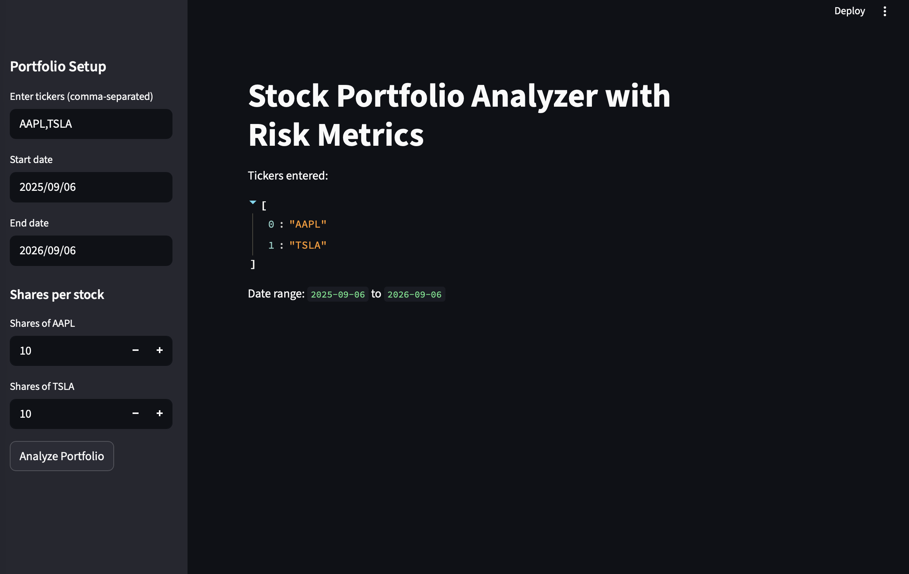
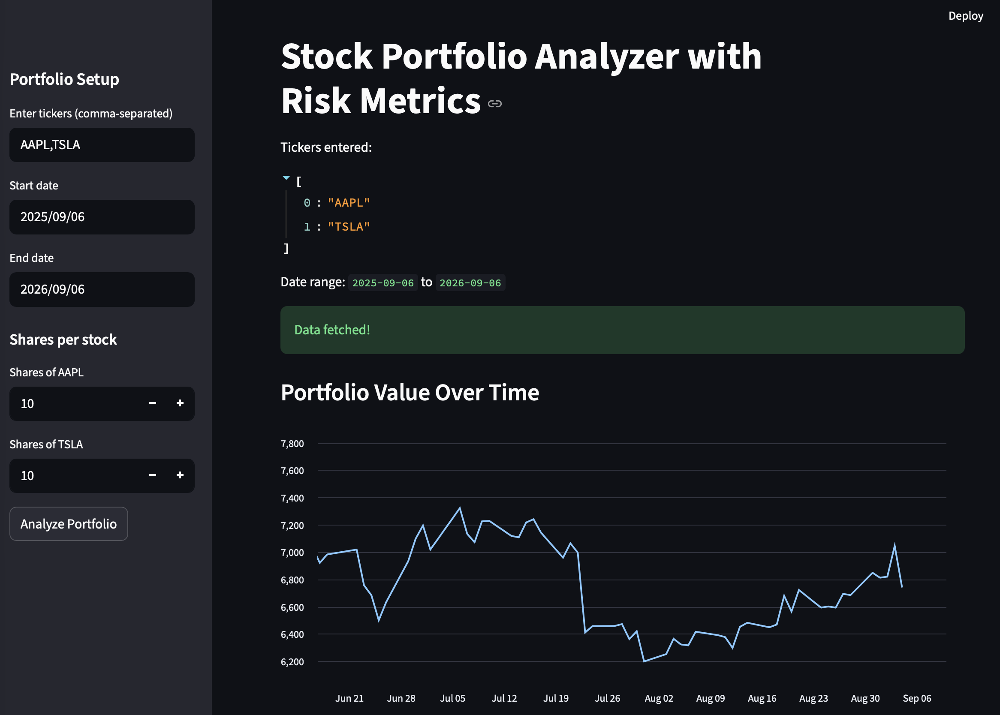
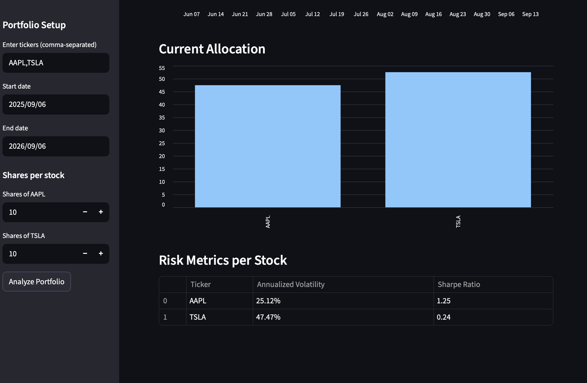

# Stock Portfolio Analyzer with Risk Metrics

A Streamlit web app that lets you build a mock stock portfolio, visualize its value over time, and calculate key risk metrics — volatility and Sharpe ratio — for each holding.

🔗 **Live demo**: [add your Streamlit Cloud link here after deploying]

## Features

- Enter any combination of stock tickers and share quantities
- Fetches historical price data via [yfinance](https://pypi.org/project/yfinance/)
- Visualizes total portfolio value over a custom date range
- Shows current allocation (%) across holdings
- Calculates per-stock risk metrics:
  - **Annualized Volatility** — how much a stock's returns swing year over year
  - **Sharpe Ratio** — risk-adjusted return relative to a risk-free rate

  ## Screenshots

**Portfolio Setup & Overview**


**Portfolio Value Over Time**


**Current Allocation & Risk Metrics**


## Tech Stack

- **Python** — core logic
- **Streamlit** — web dashboard UI
- **yfinance** — market data source
- **pandas / numpy** — data processing and financial calculations

## Project Structure

```
portfolio_analyzer/
├── app.py              # Streamlit dashboard (UI + orchestration)
├── data_utils.py        # Fetches price data, computes daily returns
├── risk_metrics.py      # Volatility and Sharpe ratio calculations
├── portfolio_utils.py   # Portfolio-level value and allocation logic
├── requirements.txt     # Python dependencies
└── README.md
```

## Running Locally

```bash
git clone https://github.com/Malikabrar01/Portfolio-Analyzer.git
cd Portfolio-Analyzer
python3 -m venv venv
source venv/bin/activate       # Windows: venv\Scripts\activate
pip install -r requirements.txt
streamlit run app.py
```

The app will open at `http://localhost:8501`.

## How It Works

1. Enter tickers (e.g. `AAPL,TSLA`) and a date range in the sidebar.
2. Enter how many shares of each stock you hold.
3. Click **Analyze Portfolio** to fetch live/historical data and generate:
   - A line chart of total portfolio value over time
   - A bar chart of current allocation by ticker
   - A table of annualized volatility and Sharpe ratio per stock

## Notes

- Volatility is annualized using the standard `daily_std * sqrt(252)` approach (252 trading days/year).
- Sharpe ratio assumes a default risk-free rate of 2%, which can be adjusted in `risk_metrics.py`.
- Data is sourced from Yahoo Finance via yfinance and may occasionally be delayed or unavailable for certain tickers/date ranges.